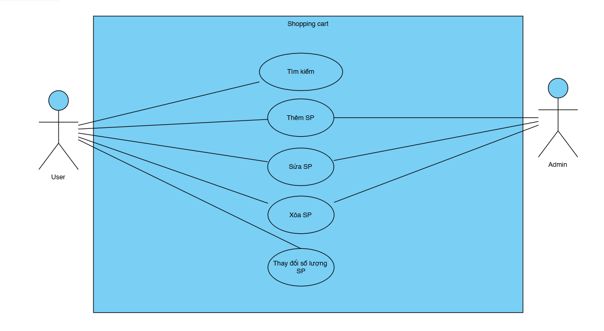
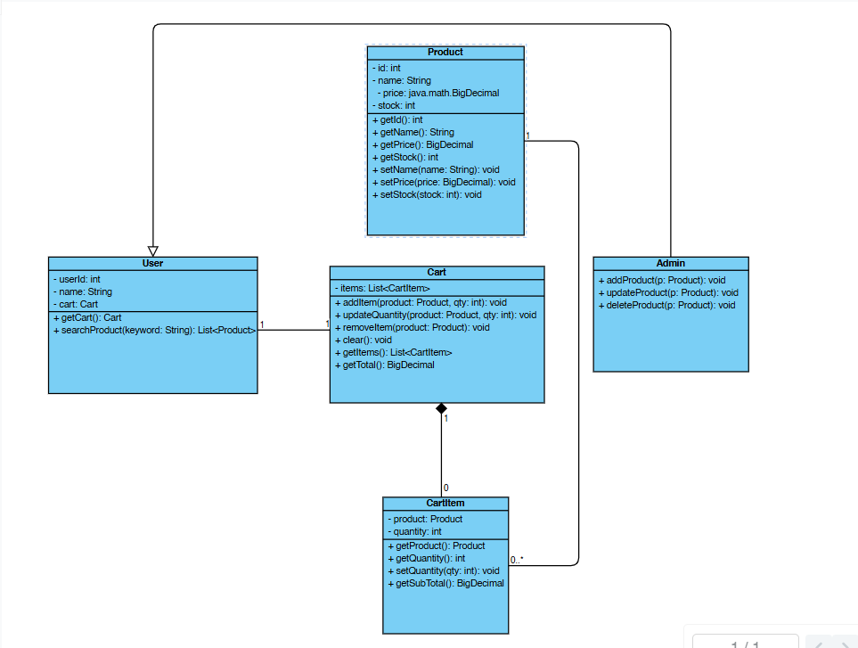
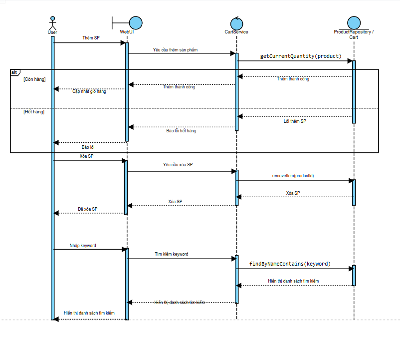
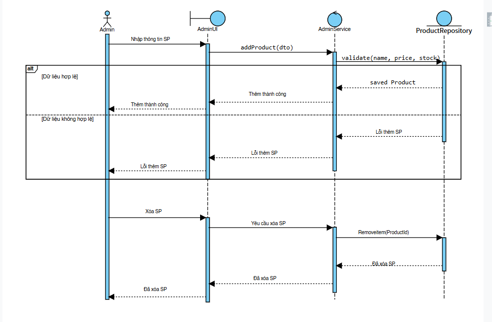

# Software Engineering Project – [Shopping-Cart]

## Giới thiệu

Dự án này được phát triển trong môn **Nhập môn Công nghệ Phần mềm**.  
Mục tiêu là áp dụng quy trình phát triển phần mềm, từ **phân tích yêu cầu, thiết kế, lập trình, kiểm thử và triển khai**.

## Thành viên nhóm

- Hoàng Minh Hạnh - N23DCPT021

  - Vai trò: Product Owner + Scrum Master (+ Dev FE)
  - Nhiệm vụ :Xác định yêu cầu, ưu tiên Backlog, đặt Sprint Goal, điều phối Sprint Planning/Daily/Review/Retro, quản lý Jira board.

- Hồ Thị Mai Linh – N23DCPT030
  - Vai trò: Developer (+ QA)
  - Nhiệm vụ :Thiết kế & code BE/FE, viết JUnit, chạy CheckStyle/PMD, chuẩn bị demo, cập nhật tiến độ dự án.

## Use Case chính

- Phân quyền Admin :Thêm, sửa, xóa sản phẩm.
- Phân quyền Người dùng: tìm kiếm, thêm sản phẩm vào giỏ hàng, xóa sản phẩm ra khỏi giỏ hàng, thay đổi số lượng sản phẩm trong giỏ hàng.
- Quản lý sản phẩm/dịch vụ
- Xử lý giao dịch
- Báo cáo & thống kê

## Phân tích & Thiết kế hệ thống UML

- **Use Case Diagram**:

  - Actor: Admin, User.
  - Use cases: - Admin: Thêm SP, Sửa SP, Xóa SP. - User: Tìm kiếm SP, Thêm SP vào giỏ, Xóa SP khỏi giỏ, Thay đổi số lượng.
    

- **Sequence Diagram**:

  - Product: id:int, name:String, price:BigDecimal, stock:int
  - CartItem: product:Product, quantity:int
  - Cart: items:List<CartItem>; addItem(product, qty), updateQuantity(product, qty), removeItem(product), clear(), getTotal( ):BigDecimal - User: userId:int, name:String, cart:Cart; getCart():Cart, searchProduct(keyword:String):List<Product> - Admin (extends User): addProduct(p:Product), updateProduct(p:Product), deleteProduct(p:Product)
    

- **ERD (Entity Relationship Diagram)**:
  - USED: 
  - ADMIN: 

## Công nghệ sử dụng

- Ngôn ngữ: Java / Python / JavaScript
- IDE: Visual Studio Code
- CSDL: MySQL / PostgreSQL
- Quản lý phiên bản: Git + GitHub
- Mô hình phát triển: Agile – Scrum

## Tổ chức và Quản lý dự án trên Jira

[Jira](https://student-team-d23cqpt01.atlassian.net/jira/software/projects/SC/boards/100/backlog)
